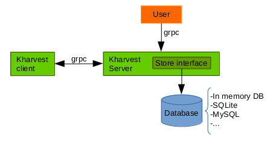
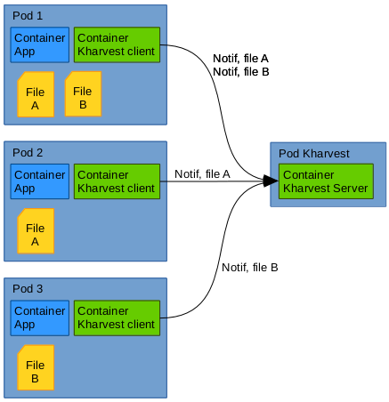
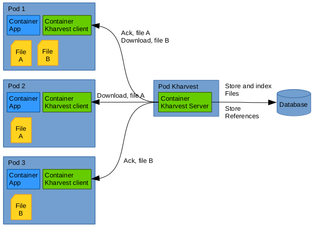

# kharvest
Harvest files in kubernetes cluster.

In a kubernetes cluster running thousand of pods, you may need to collect files produced locally in the pod. Pods being controlled by replication controller, the chance that they all produce the same file is high. Kharvest helps you to collect these files in an efficient way, transfering the file only once in the network for a set of pod producing the same file.

Kharvest comes with a server that index and store the file and a client the pushes data and notification to the server.

The server is link to a store to persist harvested files. The storage backend can be whatever database layer as soon as it implements the Store interface (see file store/interface.go).

The client can be directly be embedded in the application if it is written in Go by calling the **client.RunKharvestClient** in your main. Also it can be run as a sidecar container, in that case pay attention to mount correctly the volume where the files (of the main container) to harvest are located.

## The Server

The server is pointed by a kubernetes service. Depending on your storage implementation, you can run (or not) several instances of the server. The demo runs only one server because it use a in memory database.

## The Client

The client need to be configured, it needs to know which file it should monitor inside the container. There are two way of passing this configuration:
- Using a list of files (field **Files** in the Config struct)
- Using a configuration file (filed **ConfigPath** in the Config struct)

The advantage of the sonfiguration file is that it can be changed runtime: the client is monitoring that file and is able to react to configuration changes

## Overview

## Client Notification

When a file pointed by the configuration is modified in the client pod, the client sends notification to the server

## Server Store and Ack

On server side, all the notification are collected and the server will ask for download to only one pod for a given file. The file is stored and all the references by other pods to that same file are also stored. This way a given file is only transfered once over the network.

## File signature and reference

Each file is identified by:
- its full path
- its content MD5

The following information are also stored in the reference:
- namespace and name of the pod
- metadata (key value)
- timestamp for the notification (for each pod)

Note these informations are set by the client (except the timestamp). The **name** and the **namespace** of the pod can be collected inside the pod thanks to the Kubernetes downward API: https://kubernetes.io/docs/tasks/inject-data-application/downward-api-volume-expose-pod-information/

See the client deployment artifact and code in the demo folder for examples.

## User API

A small GRPC user API has been defined to allow consumption of the data kept in the database of the kharvest server. It helps to: 

- retrieve all the files (and notifications history) for a given pod. Also it is possbile to retrieve what are the pods that uses the same file.
- retrieve files based on the associated metadata.
- look at the activity for a given timeframe.
